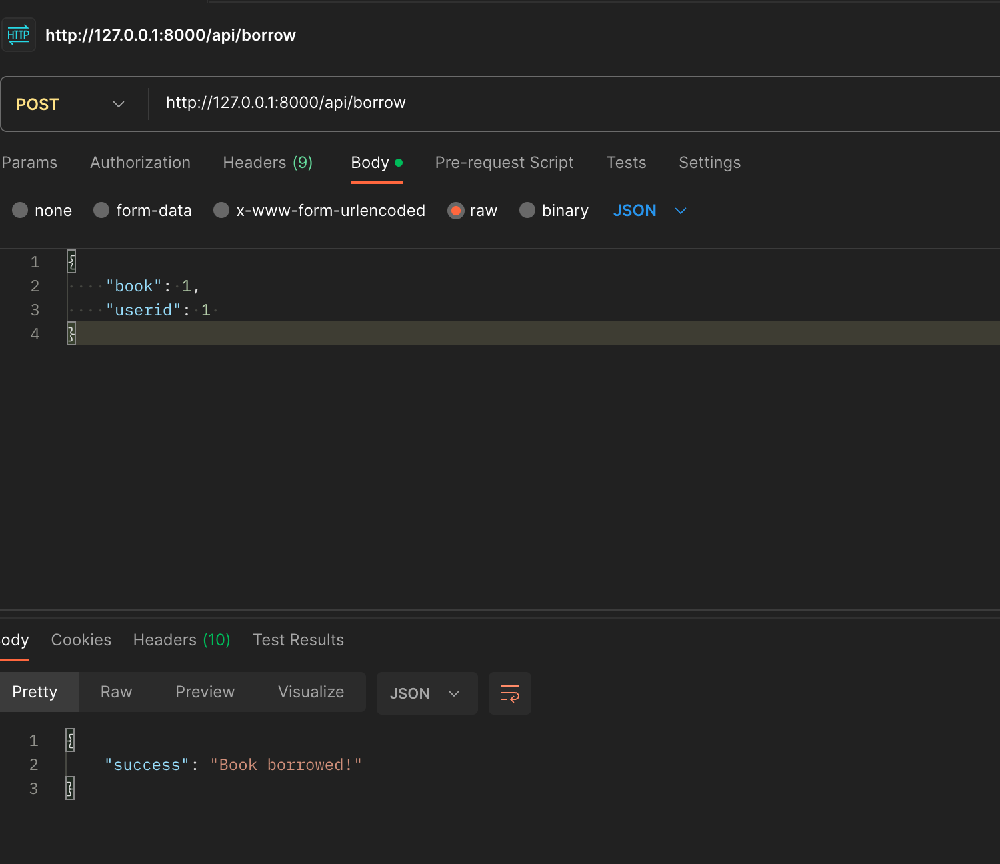

## Installation

Clone the repo
https://github.com/killerboduk1/BookLibraries.git

```bash
git clone https://github.com/killerboduk1/BookLibraries.git
cd to BookLibraries
composer install
```
copy the .env.example to .env file and add your database credentials

```bash
php artisan migrate
php artisan db:seed 

php artisan serve
```

## To Borrow a book

make a postman post request to http://127.0.0.1:8000/api/borrow


